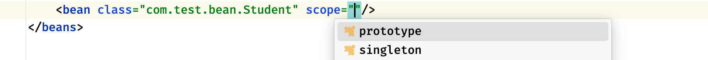

## 学习记录


通过IoC容器进行管理的Bean都是单例模式的


这里一共有两种作用域，第一种是singleton，默认情况下就是这一种，
当然还有prototype，表示为原型模式（为了方便叫多例模式也行）这种模式每次得到的对象都是一个新的：
```java
Student student1 = context.getBean(Student.class);  //原型模式下，对象不再始终是同一个了
Student student2 = context.getBean(Student.class);
System.out.println(student1 == student2);
```
实际上，当Bean的作用域为单例模式时，那么它会在一开始（容器加载配置时）就被创建，
我们之后拿到的都是这个对象。而处于原型模式下，只有在获取时才会被创建，也就是说，
单例模式下，Bean会被IoC容器存储，只要容器没有被销毁，那么此对象将一直存在，
而原型模式才是相当于在要用的时候直接new了一个对象，并不会被保存。


如果我们需要维护Bean的加载顺序（比如某个Bean必须要在另一个Bean之前创建）
那么我们可以使用depends-on来设定前置加载Bean，这样被依赖的Bean一定会在之前加载，
比如Teacher应该在Student之前加载：

```xml
<bean name="teacher" class="com.test.bean.Teacher"/>
<bean name="student" class="com.test.bean.Student" depends-on="teacher"/>
```

依赖注入：不自己 new，等着别人给

而有了依赖注入之后，Student中的Teacher成员变量，
可以由IoC容器来选择一个合适的Teacher对象进行赋值，也就是说，IoC容器在创建对象时，
需要将我们预先给定的属性注入到对象中，非常简单，我们可以使用property标签来实现，
我们将bean标签展开：

```xml
<bean name="teacher" class="com.test.bean.ProgramTeacher"/>
<bean name="student" class="com.test.bean.Student">
    <property name="teacher" ref="teacher"/>
</bean>
```

## 依赖注入：
可以这样理解吗 比方说 类A里面 需要用到类B 但是我在类A中 不是自己创建 而是通过ioc容器帮我创建 类B

你的理解**已经摸到核心了**，但可以再精准一点点，我帮你把这个比喻补得更完整，确保你完全吃透~

### 先肯定你的核心理解
你说的“类A需要类B，不在A里自己创建，而是让IOC容器帮我创建类B”，这个方向**完全正确**！
核心就是：**把“创建依赖对象”的活儿，从类自己手里，交给了IOC容器** —— 这是依赖注入的基础。

### 再补全一点点细节（让理解更精准）
严格来说，依赖注入（DI）和IOC容器的关系是：
> IOC容器不仅帮你**创建**类B的对象，还会主动把这个创建好的类B对象**“递”到**类A里（注入），类A只需要“伸手接”就行。

用你的例子再拆解：
1. 你告诉IOC容器：“我需要类A、类B的对象，你帮我管着”（通过@Service/@Bean等注解）；
2. IOC容器先创建好类B的对象（把它存在自己的“仓库”里）；
3. 容器创建类A的对象时，发现类A需要类B（通过@Autowired），就从仓库里拿出类B的对象，直接塞到类A里；
4. 类A全程没碰过“new B()”，甚至不用管B在哪，只要用就行。

### 用生活例子再强化（对应你的理解）
你是类A，你需要的“水杯（类B）”：
- 不用依赖注入：你自己去超市买水杯（new B()），水杯坏了/换款式了，你得自己再去买；
- 用依赖注入：你告诉管家（IOC容器）“我需要水杯”，管家先买好水杯（创建B对象），然后直接送到你手里（注入），你只管喝水，水杯坏了管家再换一个就行。

### 代码对应（呼应你之前的示例）
```java
// 类B（水杯）
public class B {}

// 类A（你）
@Service
public class A {
    private B b;

    // 管家（IOC容器）把买好的水杯（B对象）递给你
    @Autowired
    public A(B b) {
        this.b = b; // 你只需要接过来，不用自己买
    }
}
```

### 总结
1. 你的核心理解没错：**类A不自己创建类B，而是由IOC容器负责创建类B**；
2. 补充的关键：**IOC容器不仅创建B，还会把B主动注入到A中**，这才是“注入”的完整含义；
3. 最终效果：类A和类B彻底解耦，A只用B，不用管B的创建/来源，这就是依赖注入的核心价值。

这个理解到位后，你再看Spring里的各种注入方式（构造器/setter/字段），本质都是“管家递东西的不同方式”，就完全不会懵了~


## utf -8 英文 中文的问题

修改这里的默认编码：Settings->Editor->File Encodings->Default encoding for properties files


## springEL表达式在企业开发中的作用？
你想了解 Spring EL（Spring 表达式语言，简称 SpEL）在企业级开发中的核心作用和实际应用场景，我会从核心价值、典型使用场景、实战示例三个维度，结合企业开发的实际需求来讲解，让你清楚它能解决什么问题、怎么用。

### 1. 核心作用
Spring EL 是一种强大的表达式语言，核心价值是**在 Spring 框架中提供动态求值能力**：
它允许你在配置（注解、XML、配置文件）或代码中，以表达式的形式动态获取/计算值、访问对象属性/方法、调用静态方法、甚至执行逻辑判断，无需硬编码，让配置和代码更灵活、更动态，适配企业开发中“配置与代码解耦”“动态调整逻辑”的核心需求。

简单来说：SpEL 让你可以“用表达式写逻辑”，替代一部分硬编码的判断/取值逻辑，尤其适合需要动态读取配置、动态访问对象的场景。

### 2. 企业开发中的典型使用场景（附实战示例）
以下是 SpEL 最常用的 5 个企业级场景，每个场景都配可直接参考的代码/配置示例：

#### 场景1：动态注入属性（替代硬编码，解耦配置）
这是最基础也最常用的场景：在 `@Value` 注解中使用 SpEL，从配置文件、系统环境、Bean 属性中动态取值，而非写死值。
```java
import org.springframework.beans.factory.annotation.Value;
import org.springframework.stereotype.Component;

@Component
public class OrderService {
    // 1. 读取配置文件（application.properties）中的值：order.timeout=30
    @Value("#{${order.timeout}}") 
    private Integer orderTimeout;

    // 2. 读取另一个 Bean（userService）的属性值
    @Value("#{userService.defaultPageSize}") 
    private Integer defaultPageSize;

    // 3. 读取系统环境变量（比如服务器端口）
    @Value("#{systemEnvironment['SERVER_PORT']}") 
    private String serverPort;

    // 4. 动态计算值（比如超时时间翻倍）
    @Value("#{${order.timeout} * 2}") 
    private Integer doubleTimeout;
}
```

#### 场景2：在 Spring 注解中动态指定参数
企业开发中，很多注解的参数需要动态决定（比如缓存 key、定时任务 cron 表达式），SpEL 可以满足这个需求。
##### 示例：动态生成缓存 Key（Spring Cache 场景）
```java
import org.springframework.cache.annotation.Cacheable;
import org.springframework.stereotype.Service;

@Service
public class UserService {
    // SpEL 动态拼接缓存 key：user_用户ID
    // #userId 表示取方法参数 userId 的值
    @Cacheable(value = "userCache", key = "'user_' + #userId")
    public User getUserById(Long userId) {
        // 模拟从数据库查询用户
        return new User(userId, "张三");
    }
}
```

##### 示例：动态指定定时任务 cron 表达式
```java
import org.springframework.scheduling.annotation.Scheduled;
import org.springframework.stereotype.Component;

@Component
public class ScheduledTask {
    // 从配置文件读取 cron 表达式，动态调整任务执行频率
    @Scheduled(cron = "#{@configProperties.get('task.cron')}")
    public void doTask() {
        System.out.println("定时任务执行...");
    }
}
```

#### 场景3：在 XML 配置中动态取值（兼容老项目）
部分企业老项目仍使用 XML 配置 Spring Bean，SpEL 可在 XML 中动态配置属性：
```xml
<bean id="productService" class="com.example.ProductService">
    <!-- 动态注入另一个 Bean 的属性 -->
    <property name="maxStock" value="#{stockConfig.maxStock}"/>
    <!-- 动态计算值 -->
    <property name="minStock" value="#{stockConfig.maxStock / 10}"/>
</bean>
```

#### 场景4：在代码中手动执行 SpEL（复杂动态逻辑）
对于更复杂的动态逻辑（比如根据用户输入的表达式计算值），可以手动创建 SpEL 解析器执行表达式：
```java
import org.springframework.expression.ExpressionParser;
import org.springframework.expression.spel.standard.SpelExpressionParser;
import org.springframework.expression.spel.support.StandardEvaluationContext;

public class SpELDemo {
    public static void main(String[] args) {
        // 1. 创建 SpEL 解析器
        ExpressionParser parser = new SpelExpressionParser();
        
        // 2. 简单表达式求值
        Integer result = parser.parseExpression("100 + 200 * 2").getValue(Integer.class);
        System.out.println(result); // 输出：500
        
        // 3. 访问对象属性（复杂场景）
        User user = new User(1L, "李四");
        StandardEvaluationContext context = new StandardEvaluationContext(user);
        String userName = parser.parseExpression("name").getValue(context, String.class);
        System.out.println(userName); // 输出：李四
    }
}

class User {
    private Long id;
    private String name;
    // 构造方法、getter/setter 省略
}
```

#### 场景5：条件化配置（结合 @Conditional）
企业开发中常需要根据环境/配置动态创建 Bean，SpEL 可配合 `@Conditional` 实现条件判断：
```java
import org.springframework.context.annotation.Bean;
import org.springframework.context.annotation.Conditional;
import org.springframework.context.annotation.Configuration;
import org.springframework.context.annotation.Condition;
import org.springframework.context.annotation.ConditionContext;
import org.springframework.core.env.Environment;
import org.springframework.core.type.AnnotatedTypeMetadata;

@Configuration
public class DataSourceConfig {
    // 当配置文件中 db.type=mysql 时，才创建 MySQL 数据源 Bean
    @Bean
    @Conditional(MySQLCondition.class)
    public DataSource mysqlDataSource() {
        return new MySQLDataSource();
    }

    // 自定义条件类，使用 SpEL 判断
    static class MySQLCondition implements Condition {
        @Override
        public boolean matches(ConditionContext context, AnnotatedTypeMetadata metadata) {
            Environment env = context.getEnvironment();
            // 使用 SpEL 解析配置值并判断
            return "mysql".equals(env.getProperty("db.type"));
        }
    }
}
```

### 3. 企业开发中的优势
- **解耦**：将硬编码的数值、逻辑抽离到表达式/配置中，无需修改代码即可调整；
- **动态**：支持运行时动态求值，适配多环境、多场景的动态配置需求；
- **简洁**：用简洁的表达式替代复杂的 Java 逻辑（比如缓存 key 拼接、数值计算）；
- **统一**：在注解、XML、代码中都能使用，是 Spring 体系内统一的表达式语言。

### 总结
1. SpEL 核心作用：为 Spring 提供**动态求值能力**，实现配置与代码解耦、逻辑动态调整；
2. 核心使用场景：`@Value` 动态注入、缓存/定时任务注解参数、XML 配置、代码中动态求值；
3. 企业价值：减少硬编码、适配多环境、简化动态逻辑，是 Spring 企业开发中提升灵活性的核心工具。

## AOP面向切片

AOP（Aspect Oriented Programming）思想实际上就是：在运行时，动态地将代码切入到类的指定方法、指定位置上。
也就是说，我们可以使用AOP来帮助我们在方法执行前或执行之后，做一些额外的操作，实际上，它就是代理！

在不修改代码的情况下 添加前置操作 或者后置操作


execution：用于匹配方法执行连接点。这是使用Spring AOP时使用的主要点切割指示器。

修饰符 包名.类名.方法名称(方法参数)

修饰符：public、protected、private、包括返回值类型、static等等（使用*代表任意修饰符）
包名：如com.test（* 代表全部，比如com.*代表com包下的全部包）
类名：使用*也可以代表包下的所有类
方法名称：可以使用*代表全部方法
方法参数：填写对应的参数即可，比如(String, String)，也可以使用*来代表任意一个参数，使用..代表所有参数。